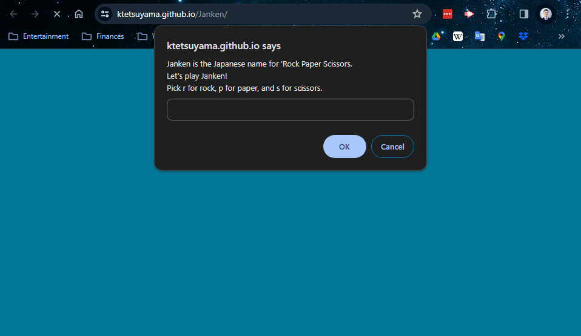

# Janken

## Description

A game or Rock Paper Scissors that is played through prompts. "Janken" is the Japanese word for the title of this game.

## Table of Contents

- [Introduction](#introduction)
- [Problem](#problem)
- [Solution](#solution)

## Introduction

I created this game for fun and to practice writing "for" loops.

## Problem

I need a quick game to play that tallies my wins, losees, and ties. I also need the game keep track of how many games I have played.

## Solution

I coded up this game in Javascript. It allows a player to choose "r" for rock, "p" for paper, and "s" for scissors. It then compares the player's choice to the computer's random choice and determines the winner.

Rock beats Scissors
Scissors beats Paper
Paper beats Rock

The game will keep track of wins, losses, and ties, as well as how many times the game has been played.

[Link to the deployed application](https://ktetsuyama.github.io/Janken/)

## Credits

I collaborated Alex Baumgartner and John Young to troubleshoot any bugs that I had during development of this application.

Tutorials used:

[How to create line breaks in Prompt/alert/confirm boxes.](https://www.bitdegree.org/learn/best-code-editor/javascript-confirm-example-3)

## License

MIT License
